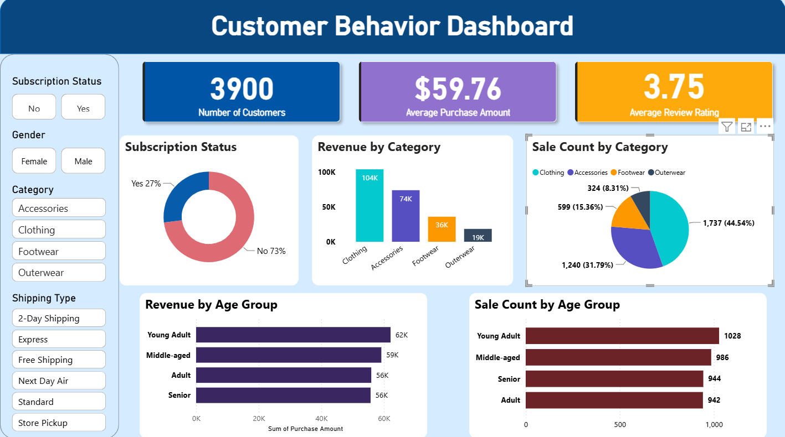

# 👨🏻‍💻Customer Behavior Data Analyst Portfolio Project
An end-to-end data analytics project, designed to analyze customer shopping behavior based on their purchasing data. It covers the key stages of the analytics process, including data preparation, cleaning and transformation, database integration, exploratory analysis, visualization, insight generation, and business reporting.

---


## 📌 Table of Contents

* <a href="#overview">Overview</a>
* <a href="#business-problem">Business Problem</a>
* <a href="#dataset">Dataset</a>
* <a href="#tools--technologies">Tools & Technologies</a>
* <a href="#project-structure">Project Structure</a>
* <a href="#exploratory-data-analysis">Exploratory Data Analysis</a>
* <a href="#research-questions--findings">Research Questions & Findings</a>
* <a href="#dashboard">Dashboard</a>
* <a href="#how-to-run-this-project">How to Run This Project</a>
* <a href="#final-recommendations">Final Recommendations</a>
* <a href="#author--contact">Author & Contact</a>

---

<br>
<h2><a class="anchor" id="overview"></a>Overview</h2>
This project analyzes retail inventory and sales data to evaluate vendor performance. The aim is to get insights for purchasing pricing and inventory optimization. The data pipeline includes the following:

✅ Data Preparation, Modeling & Exploratory Data Analysis (Python): Clean and transform the raw dataset for analysis.

✅ Data Analysis (SQL): Run queries to extract insights on customer segments, loyalty, and purchase drivers.

✅ Visualization & Insights (Power BI): Build an interactive dashboard that highlights key patterns and trends, enabling stakeholders to make data-driven decisions.


---

<br>
<h2><a class="anchor" id="business-problem"></a>Business Problem</h2>

A top retail firm wants to understand the shopping habits of its customers to lead the sales growth, improve customer satisfaction and foster long-time customer loyalty. The management is interested in what they need to know about the key factors that affect purchasing, including discounts, customer reviews, seasonality and preferred payment methods. They also wish to uncover trends that can be used to understand customer retention and repeat purchases.

The aim of this analysis is to derive meaningful trends and consumer behavior patterns from the consumer's shopping behavior, which can help in taking data-driven business decisions.

**Key Business Question**

What information gained from consumers' shopping behaviors can the company leverage to detect trends, enhance engagement and retention, and optimize marketing, sales and product strategies?

---

<br>
<h2><a class="anchor" id="dataset"></a>Dataset</h2>
- The csv file was loaded into the `/data/` folder
- Cleaning and transofrmation of raw data was done in Python
- Missign values were handled
- The transformed dataset was connected to PostgreSQL for further data analysis using SQL.


---

<br>
<h2><a class="anchor" id="tools--technologies"></a>Tools & Technologies</h2>

**Cleaning and Analysis**

- 🐍 Python
- 🐼 Pandas

**Database/Libraries**

- 🔌 psycopg2
- 🗄️ PostgreSQL

**Data Visualization**

- 📈 Dashboard Tool (Power BI)

**Development Environment**

- 💻 VS Code
- 📓 Jupyter Notebook


---

<br>
<h2><a class="anchor" id="project-structure"></a>Project Structure</h2>

```
vendor-performance-analysis/
│
│
├── notebooks/             #jupyter notebooks
│   └── customer_shopping_behavior.ipynb
│
├── data/             #csv file for the dataset
│   └── customer_shopping_behavior.csv
│
├── dashboard/             #power bi dashboard file
│   └── Customer Dashboard.pbix
│
│
├── README.md
├── requirements.txt
├── analysis_report.pdf
└── .gitignore
```


---

<br>
<h2><a class="anchor" id="exploratory-data-analysis"></a>Exploratory Data Analysis</h2>
- Looked for null values in the dataset. 37 values in the Review Rating column were found to be null.
- Instead of using the overall median, missing review ratings were replaced with the median review rating calculated separately for each product category.
- Converted all the column names to snake case for more readability.
- Created new column for age_group to put customers in their respective age segments.
- Created purchase_frequency_days to map the duration with a numeric value of days.
- Compared discount_applied and promo_code_used columns to see if they were redundant, and then dropped out promo_code_used column.
- Connected the transformed database to PostgreSQL server.


---

<br>
<h2><a class="anchor" id="research-questions--findings"></a>Research Questions & Findings</h2>

**Revenue generated by gender:** Male customers were found to have generated more revenue than female customers.

**Customers spending more than the average purchase amount:** 839 customers found spending more than the average purchase amount.
Top 5 products with highest average review rating.

**Standard vs express shipping:** Average amounts were found to be almost the same

**Subscribed vs Non-subscribed customers:** Average spend was about the same. The non-subscribed customers generated much more revenue compared to subscribed customers.
Top 5 products with highest % of purchases with discounts applied.

**Customer Segmentation:** Customers were found to be in three categories- New, Returning and Loyal based on their previous purchases.

Three most purchased products within each category.

Correlation between repeat buyers and their subscription.

Found the revenue contribution for each age group.


---

<br>
<h2><a class="anchor" id="dashboard"></a>Dashboard</h2>
The Power BI Dashboard shows:
- Category-wise revenue and sale count
- Age-wise revenue and sale count
- Average purchase amount by age-group and category
- Slicer to dynamically filter the values on the visual page

### Dashboard Preview


---

<br>
<h2><a class="anchor" id="how-to-run-this-project"></a>How to Run This Project</h2>

1. Clone the Repository
```bash
git clone https://github.com/joshiaviral/customer-behavior-project-python-sql-powerbi.git
```
(Creating a new virtual environment is recommended)


2. Open customer_shopping_behavior.ipynb notebook
 - `notebooks/customer_shopping_behavior.ipynb`
This file contains:

      - Data Import

      - Data exploration

      - Data cleaning

      - Connection to SQL Database

3. **Load the data from Python notebook into MySQL/PostgreSQL/MS SQL Server**

Create a database in SQL

      - Run Python code to load data into SQL database
  
      - Open **customer.sql**
  

4. **Connect the SQL Database to Power BI**

      - Open **Customer Dashboard.pbix**
   


---

<br>
<h2><a class="anchor" id="final-recommendations"></a>Final Recommendations</h2>
- Promote benefits for subscribers so as to attract more subscriptions.
- Reward repeat buyers with coupons, discounts, scratch cards so that they move to the ‘Loyal’ segment.
- Best-selling products need to be positioned and highlighted in campaigns
- Target high-revenue age groups and express-shipping users more
- Discount policies should be managed to boost sales while maintaining margins.


---

<br>
<h2><a class="anchor" id="author--contact"></a>Author & Contact</h2>

### Aviral Joshi

📧 **Email:** aviraljoshi17@gmail.com

🔗 **GitHub:** https://github.com/joshiaviral

💼 **LinkedIn:** https://www.linkedin.com/in/aviral-joshi-24a782225/


---
